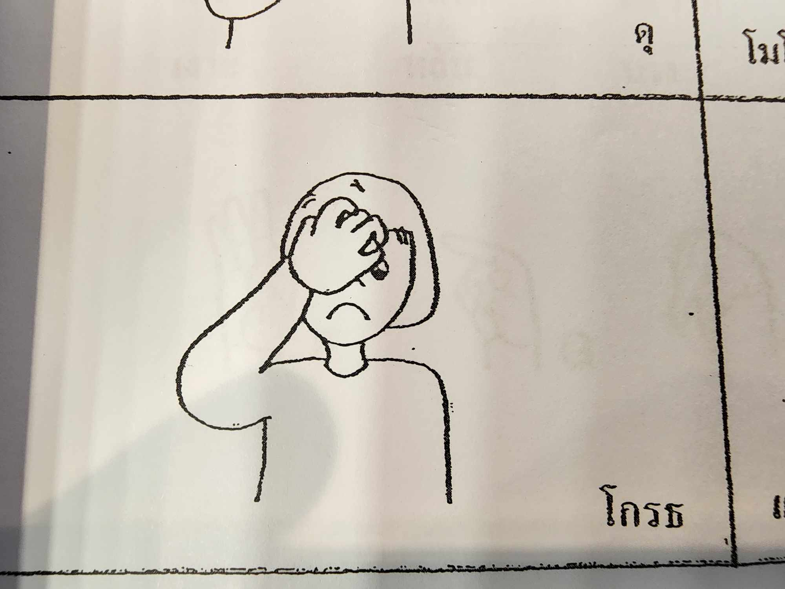
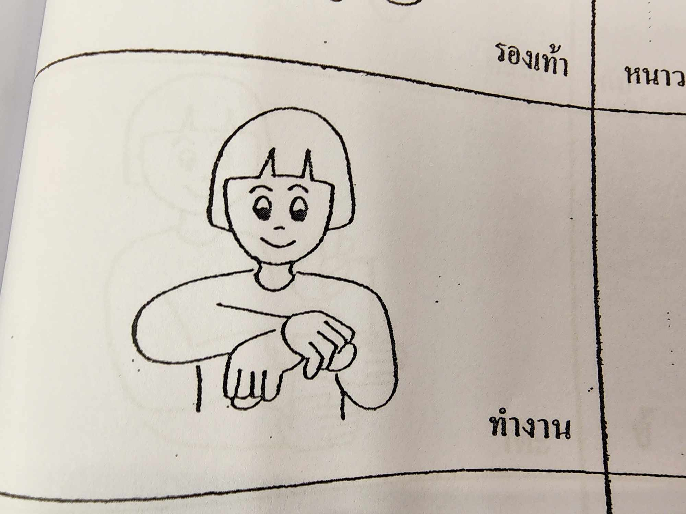
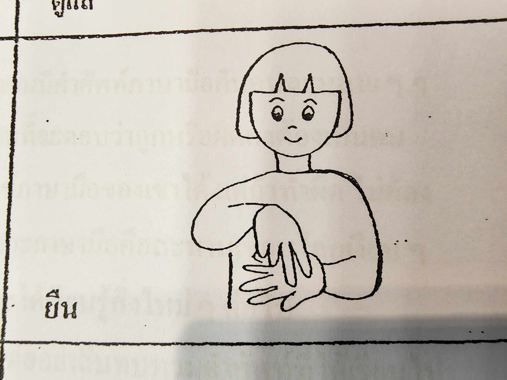
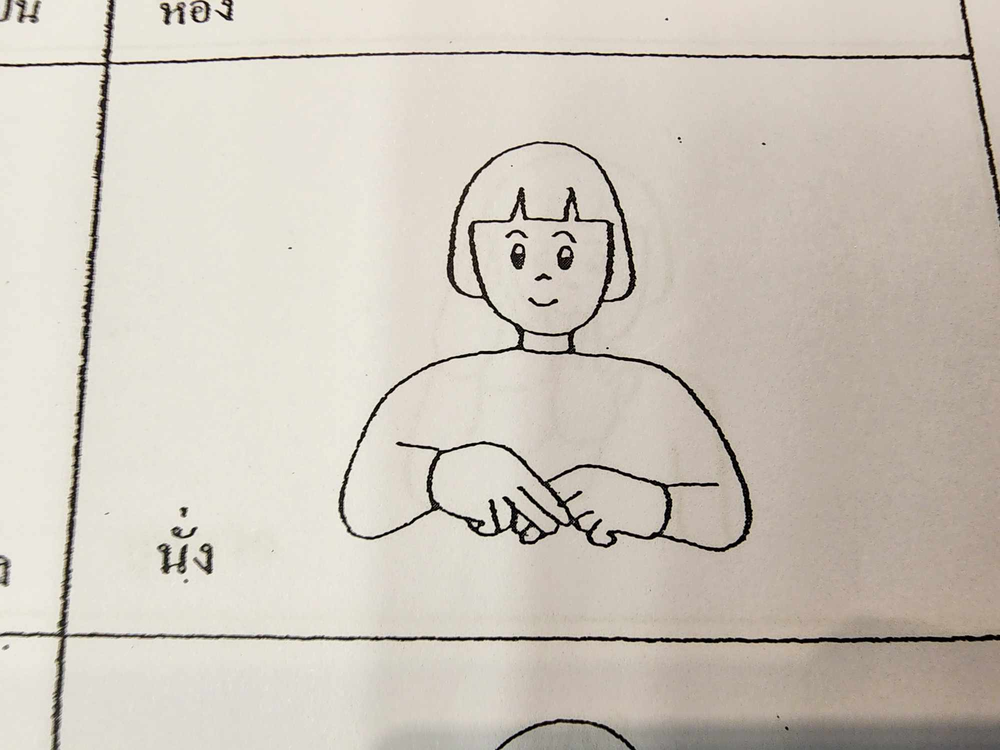
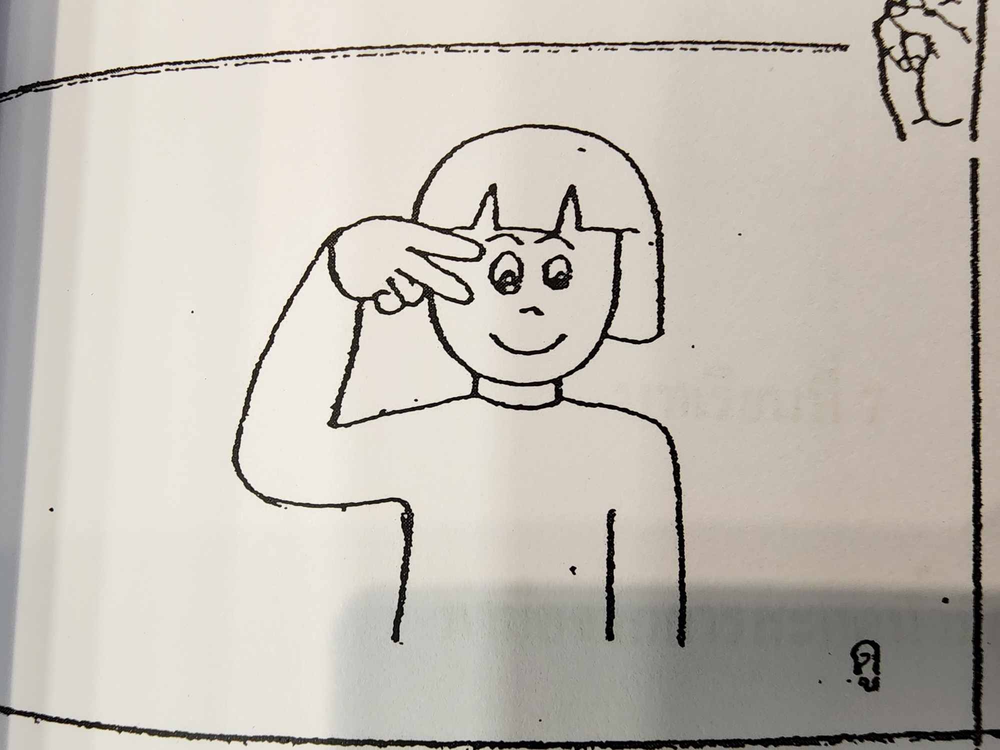
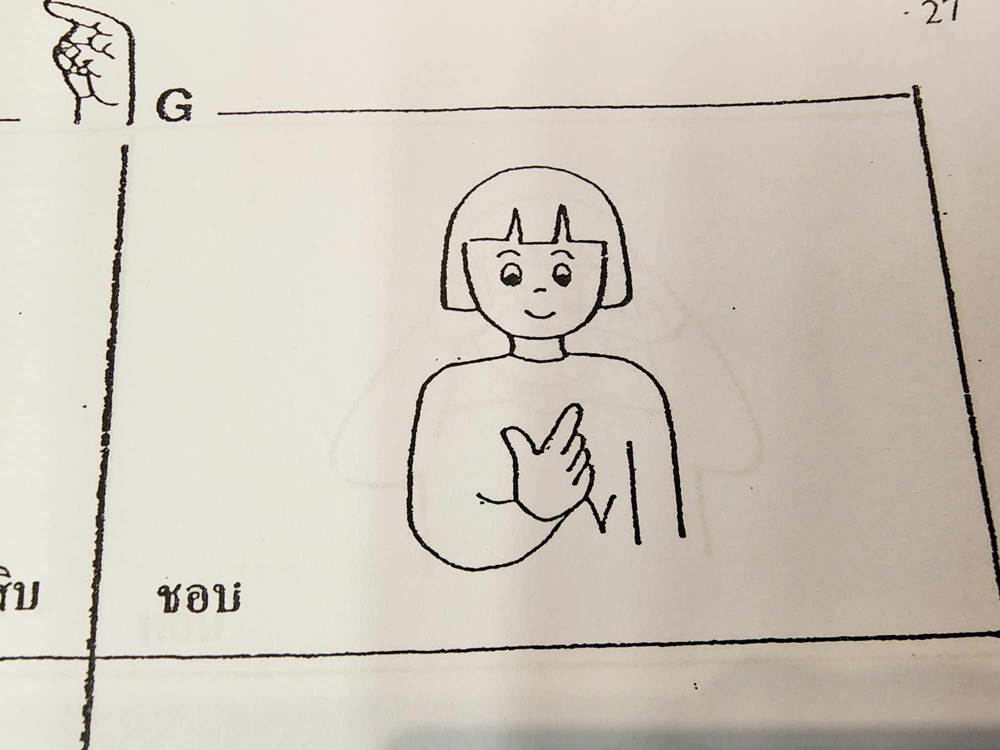
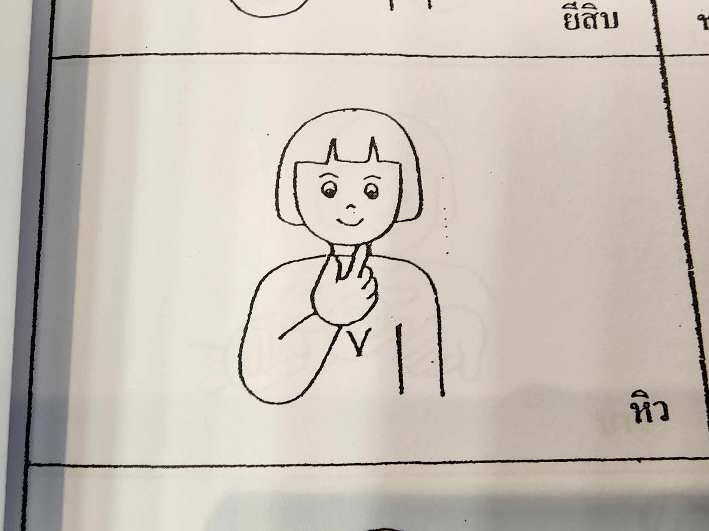
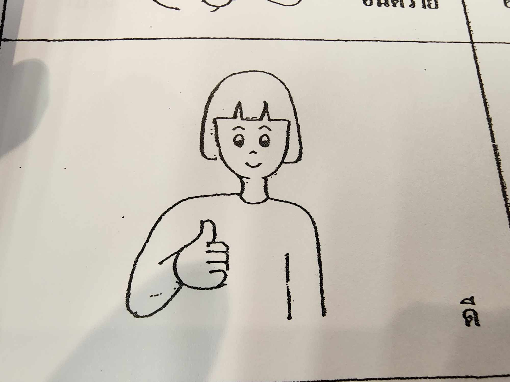
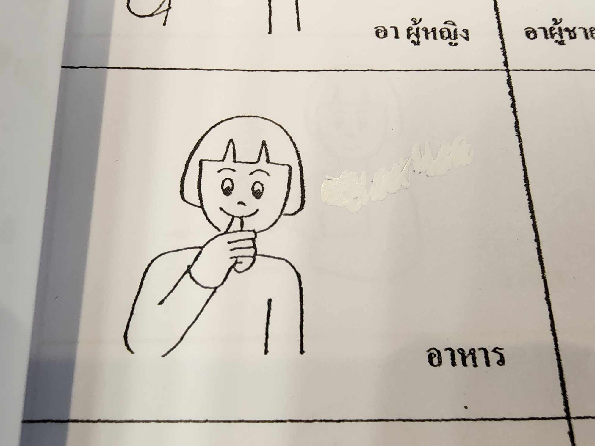
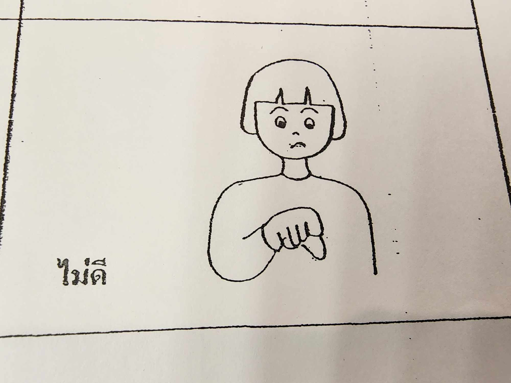

# hand_language_model

## Description

The project focuses on developing a hand language detection model aimed at predicting the actions represented by hand gestures in images. Specifically designed for the Thai hand language, this model serves as a test bed to explore the capabilities of deep learning models in understanding and interpreting Thai hand gestures. The training methodology involves fine-tuning processes to enhance and optimize the model's predictive accuracy.

This project's primary goal is to investigate the feasibility and efficacy of applying deep learning techniques to recognize and interpret Thai hand gestures. It serves as an experimental endeavor to assess the model's ability to predict various hand movements and their associated meanings within the context of the Thai sign language.

The intention behind this endeavor is not for a final production model but rather an exploratory initiative to evaluate the adaptability and potential improvements of deep learning models when applied to the recognition of Thai hand language gestures.

This model only support 10 word in Thai hand language

### 1. Angry

### 2. Working

### 3. Stand

### 4. Sit

### 5. Looking

### 6. Like

### 7. Hungry

### 8. Good

### 9. Food

### 10. Bad

### 11. Doing nothing (return as background)
## Table of Contents

- [Installation](#installation)
- [Usage](#usage)
- [Features](#features)
- [Authors](#authors)

## Installation

This project does not require installation in the traditional sense. The final model is available in the following formats:

- Final Model in .tflite format: Located in the 'Final Model' folder.
- Model in .h5 format: Found in the 'Model' folder.

Please note that this model specifically supports recognition for 10 hand language words in Thai. Users can directly utilize the provided models without any need for installation or setup procedures.

## Usage

This project comprises multiple .py files that collectively handle various aspects, from data preparation to model training, result analysis, and the final conversion of the model into the desired format. Each .py file serves a specific purpose:

#### `augmentor.py`
Performs data augmentation for each class folder of images to expand the dataset and add variation to enhance the model.

#### `deploy.py`
Used for testing the model's performance in real-time using the laptop's camera to observe the individual performance of each model.

#### `hand_language_model.ipynb`
An interactive Jupyter Notebook file designed for training the model. Utilizes MobilenetV2 for transfer learning and fine-tuning processes.

#### `random_delete.py`
Allows for the random deletion of images within folders, introducing randomness to the dataset.

#### `rename.py`
Used to rename all images within folders to a standardized naming format for ease of understanding and management.

#### `split_data.py`
Splits the data into train, test, and validation folders for each class. This step is essential to format the data appropriately for training.

#### `tflite_converter.py`
Converts the trained model into a .tflite file, enabling compatibility for deployment in an Android application.

Users can explore and use these individual Python scripts according to their requirements for managing different stages of the project. Execute each script according to its specific function within the project workflow.

## Authors

`KOBAYASHI-UwU`

